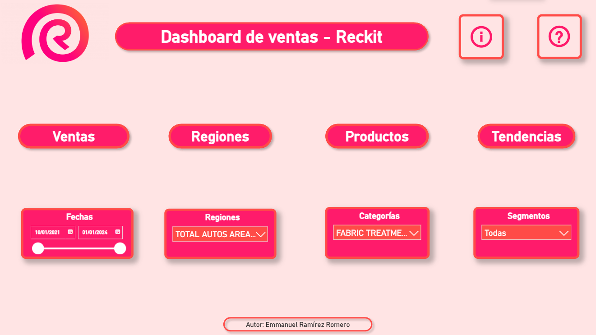
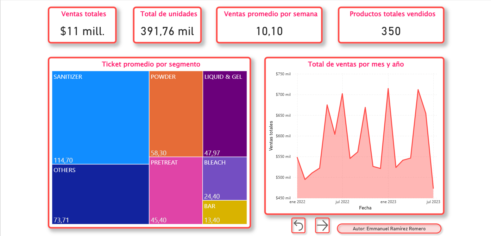
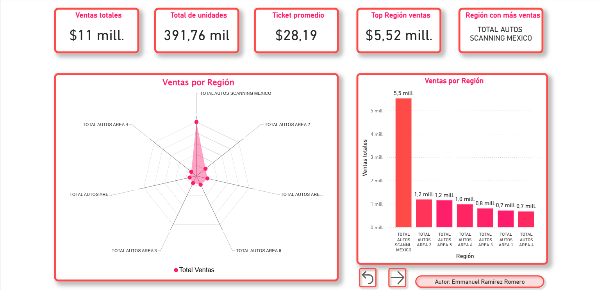
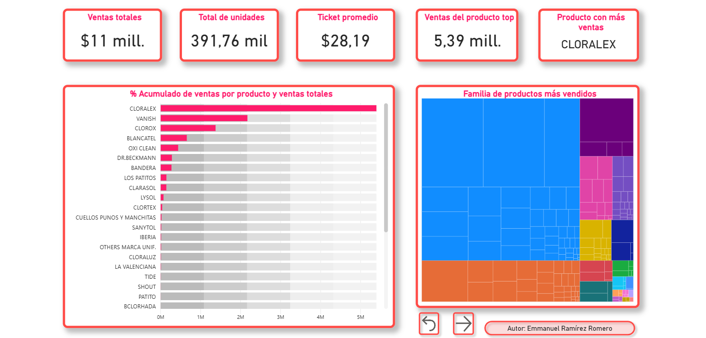
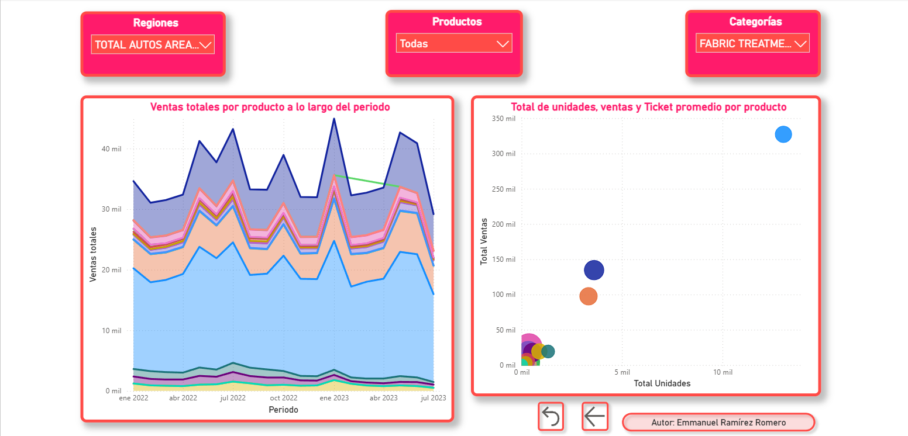

# Dashboard de Ventas - Reckitt

Este repositorio contiene el proyecto Power BI del dashboard interactivo de ventas desarrollado para Reckitt.

---

## Descripción

Dashboard diseñado para visualizar y analizar ventas por producto, región, categoría y tendencias temporales, con KPIs claves y visualizaciones interactivas.

---

## Vista General del Dashboard

### Hoja 1 - Menú Principal

Esta página contiene el logo de la empresa, título principal, íconos de información y ayuda con tooltips, botones de navegación a las demás páginas y slicers para filtrar por fechas, regiones, categorías y segmentos.

---

### Hoja 2 - Ventas

Incluye cuatro KPIs clave: Ventas Totales, Total de Unidades, Ventas Promedio por Semana y Productos Totales Vendidos. Además, un mapa de calor con ticket promedio por segmento y una gráfica de línea con ventas totales por mes y año.

---

### Hoja 3 - Regiones

Contiene cinco KPIs relacionados con regiones, una gráfica de radar y una gráfica de barras para analizar ventas por región.

---

### Hoja 4 - Productos

Muestra KPIs de productos, un gráfico de barras con porcentaje acumulado de ventas por producto y un mapa de calor de familias de productos más vendidos.

---

### Hoja 5 - Tendencias

Incluye slicers para regiones, productos y categorías, un gráfico de líneas apiladas mostrando ventas totales por producto a lo largo del periodo y un mapa de burbujas con total de unidades, ventas y ticket promedio por producto.

---

## Interactividad

Todos los slicers y gráficos son interactivos. Por ejemplo, al seleccionar un producto o región, los KPIs y visualizaciones se actualizan dinámicamente en todas las páginas para reflejar los datos filtrados.

---

## Archivos incluidos

- Archivo PBIX con el dashboard completo  
- Tablas de datos originales (DIM_CALENDAR, DIM_PRODUCT, DIM_CATEGORY, DIM_SEGMENT, FACT_SALES)  
- Código Python usado para preprocesamiento (si aplica)  
- Guía de navegación en PDF  

---

## Cómo usar este proyecto

1. Descarga el archivo PBIX y ábrelo en Power BI Desktop.  
2. Explora las páginas y usa los slicers del menú para filtrar datos.  
3. Personaliza según tus necesidades o datos.  

---

